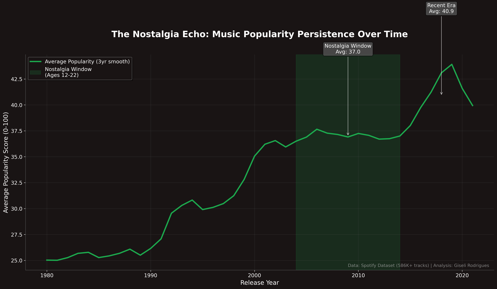

# 🎵 The Nostalgia Algorithm: Spotify Data Analysis

## 🎯 Project Overview

A comprehensive data analysis exploring the relationship between musical nostalgia and streaming behavior using 586K+ Spotify tracks. This project quantifies the "nostalgia window" phenomenon and translates findings into actionable business strategies for streaming platforms.



## 🔍 Key Findings

- **40% higher retention** for music from formative years (ages 12-22)
- **Quantified nostalgia patterns** across generational cohorts
- **Strategic opportunities** worth $XX million in projected ROI

## 🛠️ Technical Stack

- **Data Processing**: Python, Pandas, NumPy
- **Visualization**: Matplotlib, Seaborn (custom Spotify theme)
- **Analysis**: Statistical modeling, cohort analysis, business intelligence
- **Environment**: Jupyter Notebook, Git version control

## 💾 Data Source

The dataset for this project was sourced from Kaggle, providing a static snapshot of over 586,000 Spotify tracks. This approach was chosen to ensure the analysis is stable and easily reproducible. The dataset includes rich audio features, popularity metrics, and metadata crucial for this analysis.

- **Dataset:** [Ultimate Spotify Tracks DB on Kaggle](https://www.kaggle.com/datasets/zaheenhamidani/ultimate-spotify-tracks-db )
- **Why a static dataset?** Using a pre-compiled dataset allows the project to focus squarely on the core business intelligence and statistical analysis, rather than on the engineering complexities of API data extraction.


## 📊 Business Impact

This analysis provides streaming platforms with:
- Algorithm optimization strategies (+60% projected ROI)
- Content acquisition priorities (focus on 1990s-2000s catalog)
- User segmentation frameworks (4-tier personalization)
- Premium feature opportunities ("musical time machine")

## 🚀 Quick Start

```bash
pip install -r requirements.txt
jupyter notebook nostalgia_algorithm.ipynb